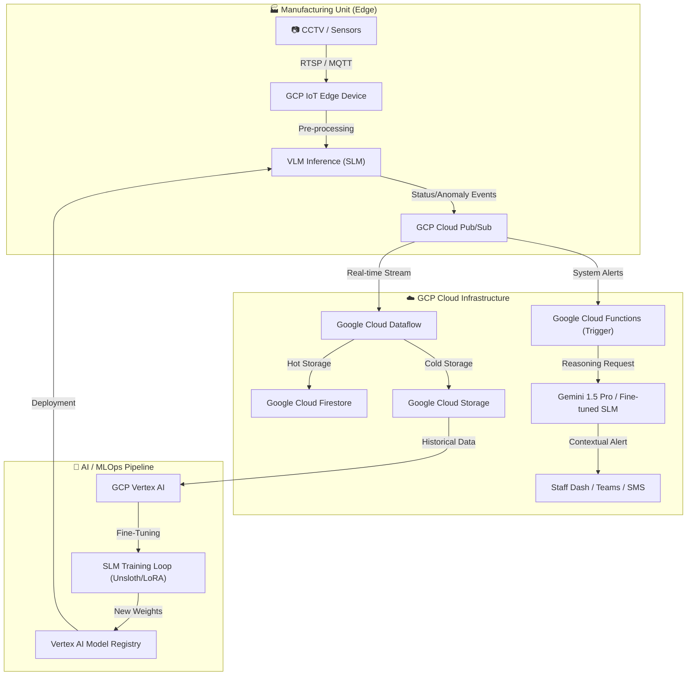

# 🏭 Production-Grade Smart Manufacturing GenAI Architecture

This plan upgrades your current Smart Manufacturing system into an advanced, production-ready AI platform using GCP Infrastructure, GenAI reasoning, and fine-tuned Small Language Models (SLMs).

---

## 🏗️ 1. System Architecture (GCP + GenAI)



---

## 🧩 2. Core Components & Logic

### A. The "Vision-Reasoning" Layer (VLM/SLM)
Instead of basic object detection, we use a **Vision-Language Model (VLM)** like **Phi-3-Vision** or **Qwen-2.5-VL** (Small Language Models).
- **Inference**: "Analyze the machine at [Zone A]. Is there any smoke or mechanical misalignment?"
- **Output**: "Anomaly detected. Conveyor belt B-402 shows excessive friction/heat signature. Maintenance required."

### B. Fine-Tuning SLM (Small Language Models)
Fine-turning an SLM for manufacturing-specific terminology (e.g., "OEE", "CNC spindle", "safety interlock breach").
- **Dataset**: Custom images of faulty vs. normal machinery.
- **Process**: QLoRA fine-tuning on GCP Vertex AI compute instances.

### C. Data & AI Pipeline (DVC + Vertex AI)
Ensuring every model version is linked to the data version that trained it.
- **DVC**: Track data in Google Cloud Storage.
- **GCP Vertex AI SDK**: Orchestrate training jobs.

---

## 🚀 3. Proposed Codebase Structure

```text
CODE/
├── gcp/                    # ☁️ GCP Cloud Infrastructure
│   ├── pubsub_config.json  # Pub/Sub setup
│   ├── provision_infra.py  # Terraform/Pulumi scripts
│   └── functions/          # Cloud Function Triggers
├── genai/                  # 🤖 GenAI & LLM Logic
│   ├── monitoring_agent.py # Gemini 1.5 Pro / Phi-3 Agent loop
│   ├── prompts/            # System prompts for reasoning
│   └── slm_inference.py    # VLM local inference engine
├── pipeline/               # ⚡ Production-Grade Pipelines
│   ├── gcp_ml_pipeline.py  # Training jobs on Vertex AI
│   ├── deployment.py       # CI/CD to Edge
│   └── data_pipeline.py    # Cloud Storage Data ingestion logic
├── src/                    # 🏗️ Core ML / Vision
│   ├── slm_finetuner.py    # Script for fine-tuning Phi-3/Qwen
│   ├── data_ingestion.py   # Real-time data processing
│   └── report_generator.py # GenAI PDF/Analytics reporting
└── requirements.txt        # Modern dependencies
```

---

## 🛠️ 4. Immediate Next Steps

1.  **Environment Setup**: Install gcloud CLI and `google-cloud-aiplatform` SDK.
2.  **Dataset Pre-processing**: Convert manufacturing telemetry/images to JSONL for SFT (Supervised Fine-Tuning).
3.  **Prototype Agent**: Create a Python script (`monitoring_agent.py`) using `langchain-google-vertexai` to reason over sensor data.
4.  **GCP Resource Provisioning**: Create the Pub/Sub topics and Firestore database.
